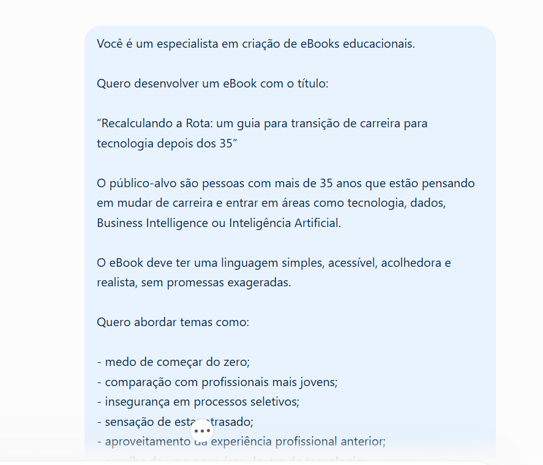
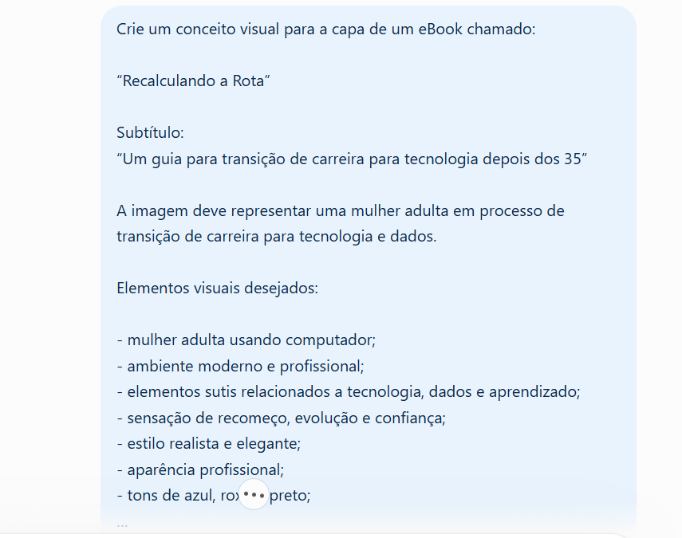

# 📘 Recalculando a Rota

## Um guia para transição de carreira para tecnologia depois dos 35

Este projeto foi desenvolvido como parte de um desafio da **DIO**, com o objetivo de criar um eBook utilizando ferramentas de Inteligência Artificial.

O tema escolhido foi a transição de carreira depois dos 35 anos, especialmente para pessoas interessadas em entrar em áreas como tecnologia, dados, Business Intelligence e Inteligência Artificial.

---

## 🎯 Objetivo do projeto

O objetivo do eBook é mostrar, de forma simples e realista, que mudar de carreira depois dos 35 pode exigir planejamento, estudo e constância, mas que experiências profissionais anteriores também podem ser aproveitadas durante essa nova fase.

O conteúdo aborda temas como:

- medo de começar do zero;
- comparação com profissionais mais jovens;
- insegurança em processos seletivos;
- sensação de estar atrasado;
- aproveitamento da experiência profissional anterior;
- escolha de uma área dentro da tecnologia;
- criação de um plano de estudos;
- construção de projetos e portfólio;
- primeiros passos com SQL, Power BI, Python e IA;
- busca por novas oportunidades.

---

## 🖼️ Capa do eBook

---

## 🤖 Processo de criação

O projeto foi desenvolvido em etapas:

1. definição do tema;
2. definição do público-alvo;
3. criação dos prompts;
4. geração da estrutura e conteúdo do eBook com apoio do ChatGPT;
5. criação do conceito visual;
6. geração das imagens com ChatGPT;
7. organização visual do conteúdo no PowerPoint;
8. revisão e ajustes manuais;
9. exportação do material final;
10. documentação do projeto no GitHub.

---

## 💬 Prompts utilizados

Durante o desenvolvimento, utilizei dois prompts principais.

### Prompt 1 — Estrutura e conteúdo do eBook

Este prompt foi utilizado para definir:

- público-alvo;
- tema;
- linguagem;
- assuntos principais;
- estrutura dos capítulos;
- exemplos práticos;
- dicas acionáveis;
- conclusão e mensagem final.

### Prompt 2 — Capa e identidade visual

Este prompt foi utilizado para criar o conceito visual do projeto, incluindo:

- mulher adulta em processo de transição de carreira;
- ambiente relacionado a tecnologia e dados;
- estilo profissional;
- tons de azul, roxo e preto;
- sensação de recomeço, evolução e confiança.

---

## 🎨 Criação das imagens

Durante o projeto, também explorei o funcionamento do **Midjourney** e aprendi sobre criação de prompts para geração de imagens.

Como a geração de imagens no Midjourney exigia um plano pago, optei por utilizar o **ChatGPT para gerar as imagens finais do eBook**.

Essa adaptação também fez parte do processo de aprendizado e permitiu comparar diferentes ferramentas de Inteligência Artificial.

---

## 📚 Conteúdo do eBook

O eBook aborda:

- os desafios de mudar de carreira depois dos 35;
- inseguranças comuns durante a transição;
- vantagens da maturidade e da experiência profissional;
- como escolher uma área dentro da tecnologia;
- caminhos iniciais para Dados, BI e IA;
- organização de um plano de estudos;
- importância de projetos práticos;
- construção de portfólio;
- preparação para processos seletivos;
- uso de ferramentas de IA no aprendizado.

---

## 🛠️ Ferramentas utilizadas

- **ChatGPT** — criação dos prompts, estruturação do conteúdo e geração das imagens
- **Midjourney** — ferramenta estudada durante o projeto para geração de imagens por IA
- **PowerPoint** — montagem e organização visual do eBook
- **GitHub** — documentação e publicação do projeto
- **DIO** — plataforma do desafio

---

## 📥 Arquivos do projeto

### 📕 eBook em PDF

[Baixar o eBook em PDF](1Recalculando_a_Rota_eBook.pdf)

---

## 🧠 Aprendizados

Durante o desenvolvimento deste projeto, pratiquei:

- criação e refinamento de prompts;
- uso de IA para geração de conteúdo;
- criação de identidade visual;
- organização de conteúdo educacional;
- uso do PowerPoint para criação de eBook;
- documentação de projetos;
- publicação no GitHub.

O projeto também mostrou a importância de adaptar ferramentas e recursos de acordo com as limitações disponíveis durante o desenvolvimento.

---

## 👩‍💻 Autora

**Deborah dos Santos**

Projeto desenvolvido como parte de um desafio da **DIO**.
